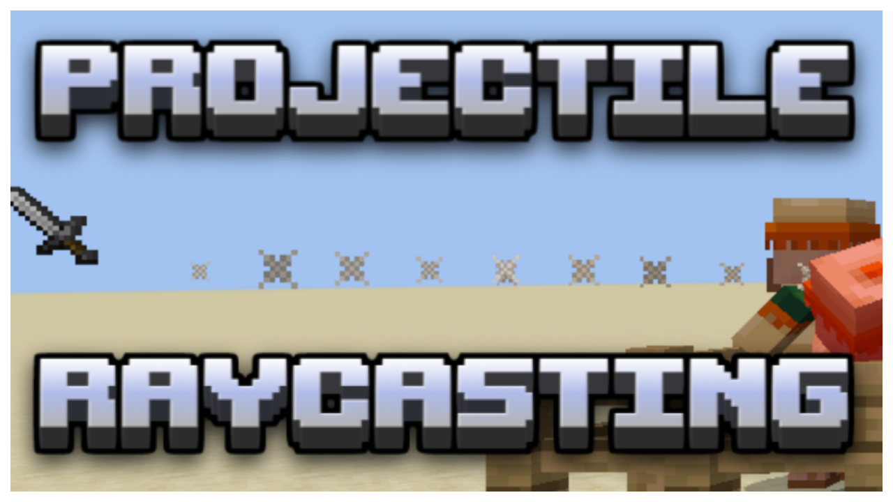

# Minecraft Slowcasting (Projectile Raycasting)
<!-- ALL-CONTRIBUTORS-BADGE:START - Do not remove or modify this section -->

<!-- ALL-CONTRIBUTORS-BADGE:END -->

## How it Works 💡
<!-- prettier-ignore-start -->
<!-- markdownlint-disable -->
This repo provides a datapack for handling projectiles which raycast iteratively to mimic /tp motion with higher control and accuracy. For example, instead of teleporting a sword with "^ ^ ^5" which could pass through walls, the slowcast system can achieve the same look while checking every block along the path to ensure it hits all targets and stops when it hits a wall.
<!-- markdownlint-enable -->
<!-- prettier-ignore-end -->

## How to Use 📝
<!-- prettier-ignore-start -->
<!-- markdownlint-disable -->

1. Place the slowcast datapack in your world, or add the namespace to your datapack. If you choose to add the namespace to your pack, include "slowcast:zprivate/init" in your load functions and "slowcast:zprivate/main" in your tick functions.
2. Go to the functions folder
3. Go to the entity/list file. If you want to add a new entity (other than markers) to become a projectile copy of the lines and paste it below. Change the score check number to a new value which indicates that new projectile and add your entity, including the tags "slowcast" and "slowcast.new". If you need to you can make it run a function instead.
4. Go to the raycast/list file. If you want to edit the behavior during motion you can add a new line with a new score check value indicating how the projectile motion behaves. Copy the "loop" file and name it what you want. Make sure to make the new line in the list file say that name.
5. Inside your loop file, #temp slowcast.itt is the value used to count recursions and must be reduced by 1 per function call. When the score is 0 you MUST include a line teleporting "@s" (which refers to the projectile entity) to ~ ~ ~. Anything tagged slowcast.this refers to the projectile, and slowcast.caster refers to the source entity. Feel free to do anything with those, the example loop file uses a hitbox to kill other entities. Finally at the bottom you must include a line that does the recursion. You can also call the "slowcast:stop" function here to stop the raycast under additional criteria such as hitting a wall. At any time the function can be called to stop a projectile.
6. Go to the end/list file. Again, copy a line, change a value, and make a new function for it to call. The functions here run commands when the projectile stops
<!-- markdownlint-enable -->
<!-- prettier-ignore-end -->

## Contributors 🧱
<!-- prettier-ignore-start -->
<!-- markdownlint-disable -->
<table>
  <tr>
    <td align="center"><a href="https://github.com/CloudWolfYT"> <b>Cloud Wolf</b></a> <a href="#" title="Project Creator">🔨</a></td>
  </tr>
</table>

<!-- markdownlint-enable -->
<!-- prettier-ignore-end -->
